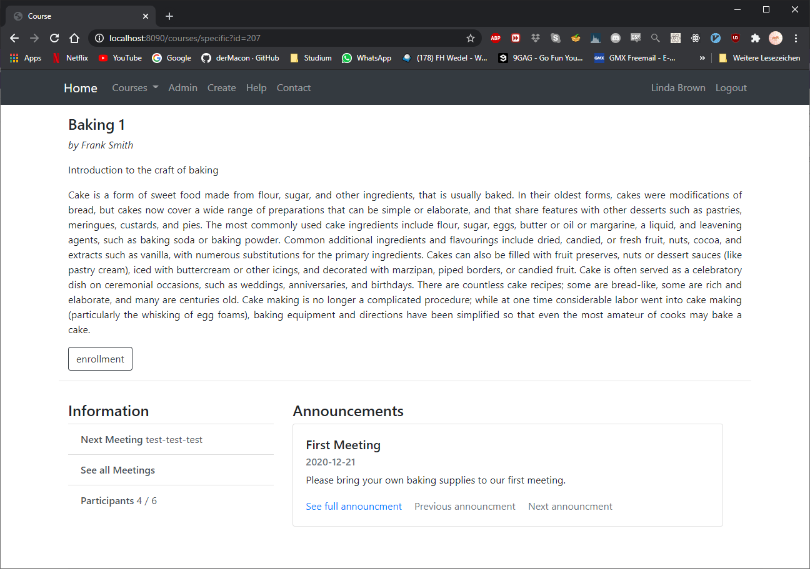

# workshop-organizer-docker
* Webapp to manage workshops. 
* Live [Server](http://168.119.120.2:8888/workshop-organizer/) - not working at the moment

## Functionality
Users can enroll and drop out of courses. An admin can promote or create users with admin or manager permissions, only those permissions make it possible for a user to create a new course. A course consists out of an panel containing all relevant information for the course such as the title, content, calender etc.. Also it is possible for the manager of the course to create announcements which will be displayed in the browser and will also be send via email to the specified course members. New users can sign up for the service using a dedicated registration endpoint. 

## Build
To build the project it is necessary to encrypt the database credentials from the `.env` file. To do this the developer must specify a gpg key from the computer in a apropriate file format in the public-keys directory. The projects admin can than incorporate this into the git-secret configuration. Once the key is aproved, the user can encrypt the file via `git secret reveal`. Afterwards it is possible run the docker-compose configuration with the the `simple-build.sh` script in the projects directory.

Steps used to build:
* set necessary environmnent variables (database credentials or reveal via git secret)
* build spring application (`mvn clean package`)
* build docker image using the Dockerimage (`./workshop-organizer/Dockerfile`)
* run containers with `docker-compose up`
* website will be available at `localhost:8888`

## Technologies used
* Spring Boot
* Hibernate
* Docker (docker-compose)
